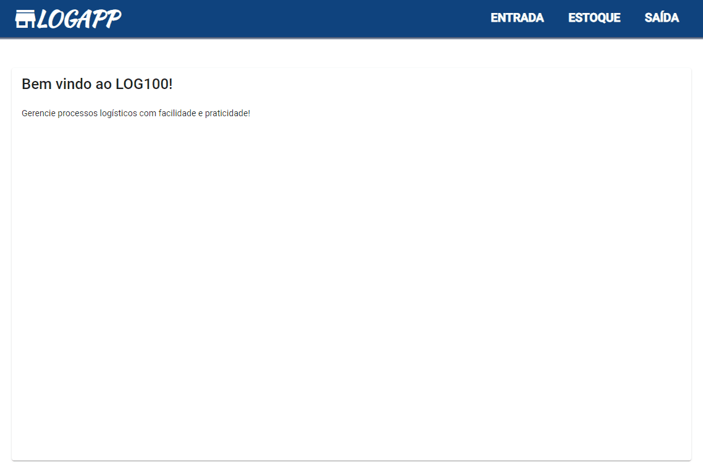

# Sistema Logístico

 Projeto que simula operações logísticas. Nele é possível cadastrar/receber produtos, gerar separações e conferir/expedir (pedidos). É constituído de duas partes: *Front-end* com **Angular 12** e *back-end* com **Java 11 (Spring Boot)**.
 
 
 
 ## Front-end 

Link para acessar a parte *front-end* (**Angular 12**) da aplicação:

https://github.com/leandrocastrold/sistema-logistico-front-end

 ## Back-end
 
 Link para acessar a parte *back-end* (**Spring Boot/PostgreSQL**) da aplicação:
 
https://github.com/leandrocastrold/sistema-logistico-back-end
 
 
